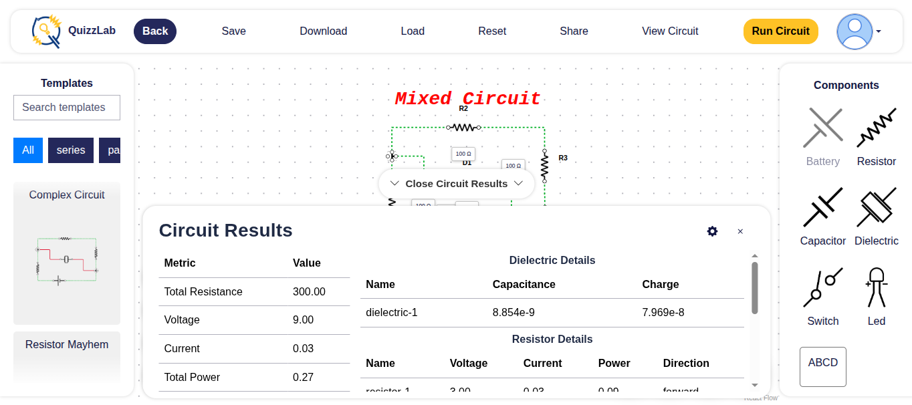
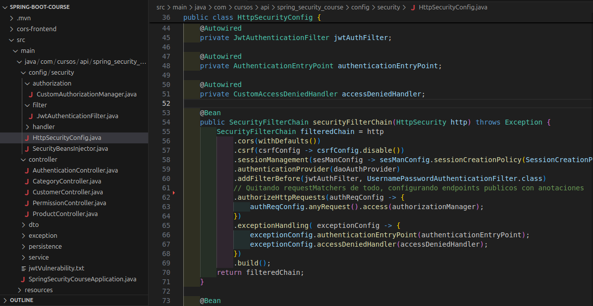

  <h1>Hi, I'm Walter 👋</h1>
  <h3>Full-Stack Developer | Informatics Engineering Student</h3>

  
  
  

---

## 🚀 About Me

I’m a **Full-Stack Developer** and **3rd-year Informatics Engineering student** passionate about building intuitive interfaces, efficient systems, and scalable applications.

I work mainly with **React**, **Node.js**, **Spring Boot**, and modern web technologies to create secure, fast, and visually polished solutions.  
I enjoy understanding how things work, improving UI/UX experiences, and turning ideas into real projects.

- 🔭 Currently working on: **Circuit simulation web apps & backend services**
- 🌱 Currently learning: **Go** & deeper **Spring Security**
- 🎯 Interests: Frontend architecture, clean code, UI/UX, scalable APIs
- 🗒️ Languages: **Spanish (Native)** · **English (Professional)**

---
## 💼 Projects

  

    <h2>🔌 Electrical Circuits Simulator</h2>
    
    

      Interactive web application designed for university students to learn electrical circuit behavior.
      Built with drag-and-drop components, dynamic node linking, and real-time simulation using <strong>ReactFlow</strong>.
    

    
<strong>Tech:</strong> React • ReactFlow • Vite • Node.js • TypeScript

    <a href="https://github.com/DEI-Developers/sistema-simulacion-circuitos-frontend" 
       style="text-decoration:none; background:#4a9eff; color:white; padding:10px 18px; border-radius:8px; font-weight:bold;">
      🔗 View Repository
    </a>
  

  

    <h2>📦 Inventory Management System (Backend)</h2>
    
    

      Backend inventory system with secure role-based access control using <strong>Spring Security</strong>.
      Includes product handling, CRUD operations, and custom permissions for different system agents.
    

    
<strong>Tech:</strong> Java • Spring Boot • Spring Security • JPA • SQL

    <a href="https://github.com/WalterRB28/Spring-Boot-Course" 
       style="text-decoration:none; background:#4a9eff; color:white; padding:10px 18px; border-radius:8px; font-weight:bold;">
      🔗 View Repository
    </a>
  

  

    <h2>🚌 School Pickup Tracking System</h2>
    
    

      System designed for private transportation drivers to monitor and manage student pickup routes.
      Sends real-time notifications to parents and allows drivers to track children effectively.
    

    
<strong>Tech:</strong> React • Node.js • Kotlin • Mobile-First UI

    <a href="https://github.com/AntonioMelgarMendez/FrontEndVaseguro" 
       style="text-decoration:none; background:#4a9eff; color:white; padding:10px 18px; border-radius:8px; font-weight:bold;">
      🔗 View Repository
    </a>
  

---

## 🛠 Tech Stack

### 💻 Languages & Frameworks

  
  
  
  
  

### 🌐 Frontend & Mobile

  
  
  
  
  
  

### 🔙 Backend & Databases

  
  
  
  
  
  

### ☁️ Cloud, DevOps & Tools

  
  
  
  
  

---

## 📊 GitHub Stats

  
  

---

## ✉️ Contact

📧 **walterramirez2805@gmail.com**  
🔗 **LinkedIn:** https://www.linkedin.com/in/walter-ramirez-546420387/  
💻 **GitHub:** https://github.com/WalterRB28  
📍 **San Salvador, El Salvador**

---
